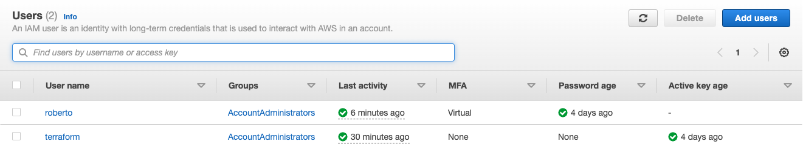
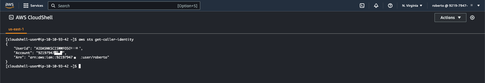
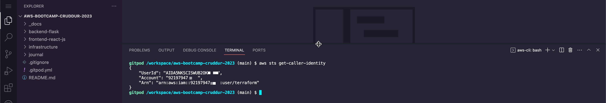
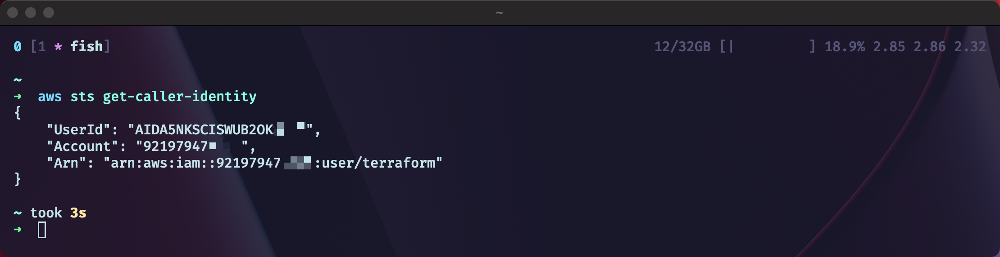
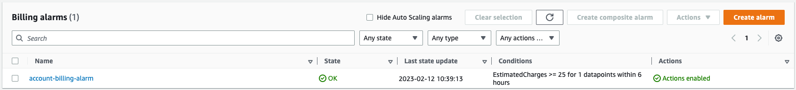
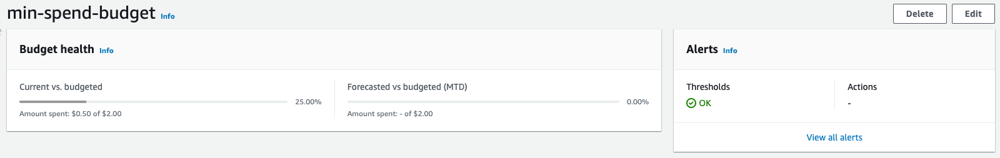
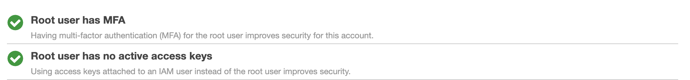
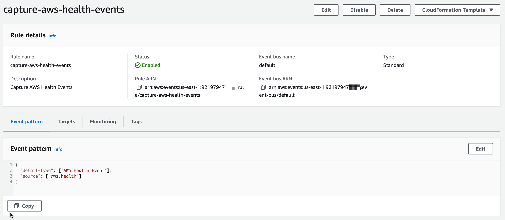
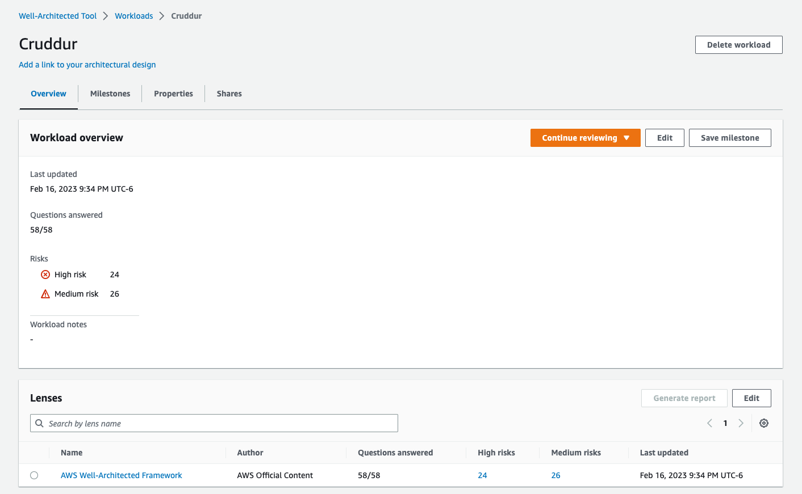

# Week 0 — Billing and Architecture

- [Week 0 — Billing and Architecture](#week-0--billing-and-architecture)
  - [Required Homework](#required-homework)
    - [Diagrams](#diagrams)
        - [CONCEPT DIAGRAM](#concept-diagram)
        - [LOGICAL DIAGRAM](#logical-diagram)
    - [IAM users](#iam-users)
    - [CloudShell](#cloudshell)
    - [AWS CLI](#aws-cli)
    - [Billing Alarm](#billing-alarm)
    - [Budget](#budget)
  - [Homework Challenges](#homework-challenges)
    - [Root Account](#root-account)
    - [Event Bridge Rule for AWS Health events](#event-bridge-rule-for-aws-health-events)
    - [Well Architected Tool](#well-architected-tool)
  - [Class Notes](#class-notes)
    - [Intro](#intro)
    - [Instructors](#instructors)
    - [Project Scenario](#project-scenario)
    - [Iron triangle](#iron-triangle)
    - [Architecture](#architecture)
      - [RRACs](#rracs)
        - [REQUIREMENTS](#requirements)
        - [RISKS](#risks)
        - [ASSUMPTIONS](#assumptions)
        - [CONSTRAINTS](#constraints)
      - [Design](#design)
        - [CONCEPTUAL DESIGN ("Napkin Design")](#conceptual-design-napkin-design)
        - [LOGICAL DESIGN](#logical-design)
        - [PHYSICAL DESIGN](#physical-design)
    - [Useful tools](#useful-tools)
      - [ASK "DUMB QUESTIONS"](#ask-dumb-questions)
      - [PLAY BE-THE-PACKET](#play-be-the-packet)
      - [DOCUMENT EVERYTHING](#document-everything)
      - [TOGAF](#togaf)
      - [AWS WELL-ARCHITECTED FRAMEWORK](#aws-well-architected-framework)

## Required Homework

### Diagrams
##### CONCEPT DIAGRAM
> Link to [Lucid](https://lucid.app/lucidchart/d8286efd-b2db-49c2-a6ac-63f4a0045780/edit?viewport_loc=-715%2C-127%2C4137%2C1479%2C0_0&invitationId=inv_e33cd10b-5114-4e80-9901-c784154ce8dd)

  

##### LOGICAL DIAGRAM
> Link to [Lucid](https://lucid.app/lucidchart/655e59e3-0047-4852-b2b5-1a672064f39d/edit?viewport_loc=-186%2C90%2C2000%2C1194%2C0_0&invitationId=inv_6157e264-be79-461e-a5d7-a6dffc5524b3)

  

### IAM users
* Created a IAM user group with the `AdministratorAccess` AWS managed policy attached
* Created two users:
  * one with just console access
    * this user has MFA setup
  * one with just API access, to be used with Terraform
    * I'll be automating everything with Terraform in an attempt to make it to Red Squat 🚀
    * As seen below, only this user has API credentials generated

> 📌 **Note**: I created two users because I want to clearly see what was done by Terraform and what was done by my user in CloudTrail

### CloudShell
I logged into my account and used CloudShell (last digits blured to prevent exposure)

### AWS CLI
I added the task to get the AWS CLI installed in Gitpod. This was done in [`742023a`](https://github.com/romogo17/aws-bootcamp-cruddur-2023/commit/742023aa3552452a092d48f3d926c5b4d73afc30)

I already use the `aws` CLI for work, I also have it installed in my workstation (last digits blured to prevent exposure)

### Billing Alarm

* Created a Billing Alarm whenever the EstimatedCharges >= $25 USD
* This alarm was created by Terraform. The automation can be found in [`infrastructure/00-billing-budgets-and-health`](../infrastructure/00-billing-budgets-and-health/)

### Budget

* Created a Budget of $2 USD
* A spend of $1 USD (threshold) will trigger an alert to my email
* The budget was created by Terraform. The automation can be found in [`infrastructure/00-billing-budgets-and-health`](../infrastructure/00-billing-budgets-and-health/)

## Homework Challenges

Aside from the challenge tasks, my main challenge during the bootcamp in order to get Red Squad 🚀 will be to automate the deployment of everything through Terraform
* As a prerequisite, I created an S3 bucket and a DynamoDB table to use the Terraform S3 backend
* All the terraform code is located under [`infrastructure/`](../infrastructure/). I'll be following the **layering** approach. The first couple layers will have independant foundational automation (billing alerts, SNS topics, DNS, etc.) and most of the actual Cruddur infrastructure will live in it's own layer

### Root Account
* Enabled `Receive Billing Alerts` under the account's Billing Preferences.
  * This was a prerequisite to setup Billing Alarms
* I also configured MFA for the root account, which is part of the homework challenges.

### Event Bridge Rule for AWS Health events
* Created an Event Bridge Rule to capture AWS Health events and send them to an SNS topic.
* The target SNS topic has a subscription with my email

### Well Architected Tool

In order to get familiar with the Well Architected Tool, I did an assessment of all the cuestions in the default lens

## Class Notes
### Intro
- Videos will be recorded in case we need to catch up

### Instructors
- Margaret Valtierra: Solutions Engineering
- Chris Williams: Principal Cloud Solutions Architect
- Shala Warner

### Project Scenario
> There's no such thing as greenfield. _Quite true_ :)

- Microservice architecture

### Iron triangle
Chose two...
- Scope (features, functionality)
- Cost (budget, resources)
- Time (schedule)

### Architecture

#### RRACs
##### REQUIREMENTS
Something that the project must achieve at the end. Technical or business oriented
- verifiable
- monitorable
- traceable
- feasible

##### RISKS
Prevents the project from being successful (must be mitigated), for example:
- SPoFs (Single Point of Failures)
- user commitment
- late delivery

##### ASSUMPTIONS
Factors held as true for the planning & implementation phases, for example:
- sufficient network bandwith

##### CONSTRAINTS
Policy or technical limitations for the project, for example:
- time
- budget
- vendor selections

#### Design
From gathering the RRACs, you create your designs

##### CONCEPTUAL DESIGN ("Napkin Design")
- Created by business stakeholders and architects
- Defines concepts and rules

##### LOGICAL DESIGN
- Defines how the system should be implemented
- Environment without actual names or sizes

##### PHYSICAL DESIGN
- Representationof the actual thing that was built (IPs of servers, ARNs of resources, etc)

### Useful tools

#### ASK "DUMB QUESTIONS"
- Why are we in the room?
- How will we get this amount of work done?
- How will it make money?
- Do we have the skillset needed to make this a reality?

#### PLAY BE-THE-PACKET
- Be as granular as possible.
- Educates you about the system you're trying to build

#### DOCUMENT EVERYTHING
- What it does, where the staful data resides, where the ephemeral data resides

#### TOGAF
TOGAF is an architecture framework that provides the methods and tools for assisting in the acceptance, production, use, and maintenance of an enterprise architecture.  It is based on an iterative process model supported by best practices and re-usable set of existing architecture assets

- Most popular framework for EA

#### AWS WELL-ARCHITECTED FRAMEWORK
Asks the right questions (from a TOGAF perspective) to highlight blindspots. Naturally falls into the RRAC buckets. Powerful tool in the architect's toolbelt.

1. Operational excellence
1. Security
1. Reliability
1. Performance efficiency
1. Cost optimization
1. Sustainability

