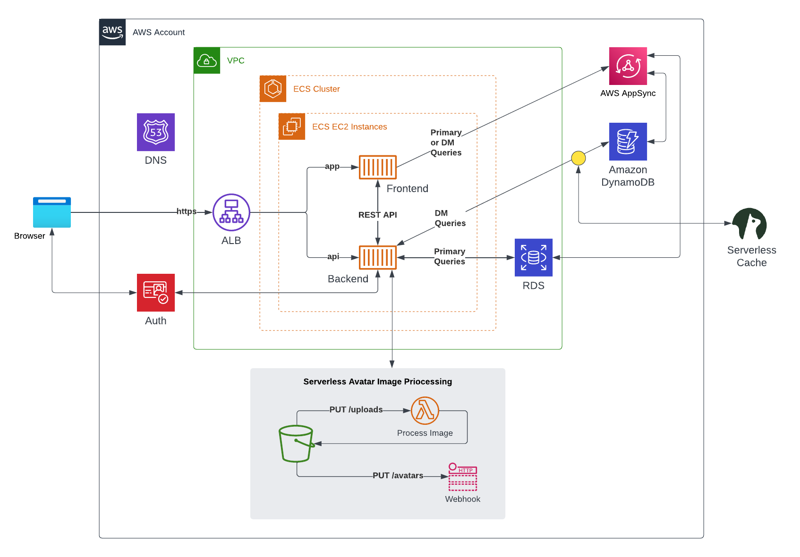
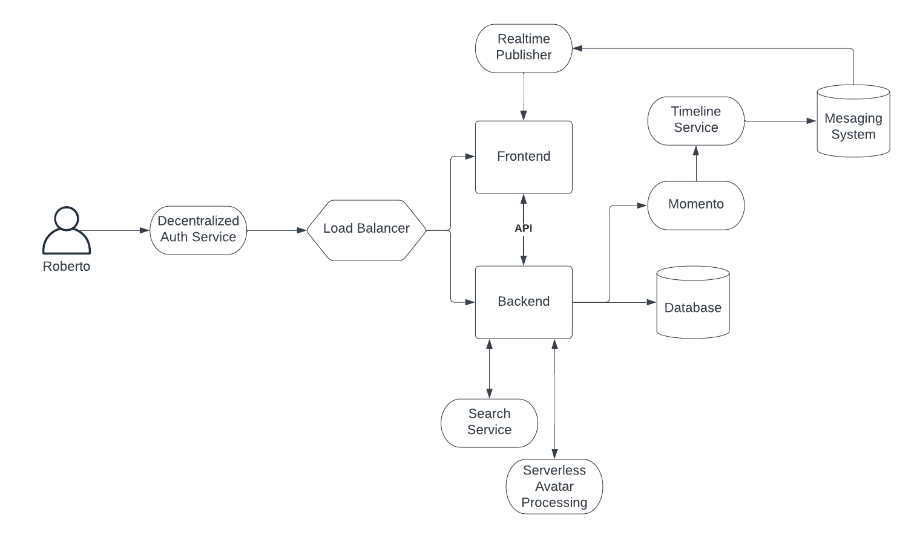

# Week 0 — Billing and Architecture

- [Week 0 — Billing and Architecture](#week-0--billing-and-architecture)
  - [Homework](#homework)
    - [Root Account Setup](#root-account-setup)
    - [Initial IAM setup](#initial-iam-setup)
    - [Terraform prep-work](#terraform-prep-work)
    - [Infrastructure deployed](#infrastructure-deployed)
    - [Diagrams](#diagrams)
        - [LOGICAL DIAGRAM](#logical-diagram)
        - [CONCEPT DIAGRAM](#concept-diagram)
  - [Class Notes](#class-notes)
    - [Intro](#intro)
    - [Instructors](#instructors)
    - [Project Scenario](#project-scenario)
    - [Iron triangle](#iron-triangle)
    - [Architecture](#architecture)
      - [RRACs](#rracs)
        - [REQUIREMENTS](#requirements)
        - [RISKS](#risks)
        - [ASSUMPTIONS](#assumptions)
        - [CONSTRAINTS](#constraints)
      - [Design](#design)
        - [CONCEPTUAL DESIGN ("Napkin Design")](#conceptual-design-napkin-design)
        - [LOGICAL DESIGN](#logical-design)
        - [PHYSICAL DESIGN](#physical-design)
    - [Useful tools](#useful-tools)
      - [ASK "DUMB QUESTIONS"](#ask-dumb-questions)
      - [PLAY BE-THE-PACKET](#play-be-the-packet)
      - [DOCUMENT EVERYTHING](#document-everything)
      - [TOGAF](#togaf)
      - [AWS WELL-ARCHITECTED FRAMEWORK](#aws-well-architected-framework)

## Homework

### Root Account Setup
* Enabled `Receive Billing Alerts` under the account's Billing Preferences
* Configured MFA for the root account ✅

### Initial IAM setup
* Created a IAM user group with the `AdministratorAccess` AWS managed policy attached
* Created two users, one with just console access, and another one with just API access (to be used with Terraform)
  * The IAM user for console access also has MFA setup ✅
  * I created two users because I want to clearly see what was done by terraform and what was done by my user in CloudTrail

### Terraform prep-work
* Created an S3 bucket and a DynamoDB table

### Infrastructure deployed
> 📌 **Note**: Terraform code located under [`infrastructure/00-billing-and-budgets`](../infrastructure/00-billing-and-budgets/) and [`infrastructure/01-route53-zone`](../infrastructure/01-route53-zone/)
* SNS topic for Billing Alarms
* CloudWatch Alert for Estimated Charges
* Zero spend budget (actual spend > 0.01)
* Route53 hosted zone that will be the SOA of my domain's subdomain for `cruddur`

### Diagrams
##### LOGICAL DIAGRAM
> Link to [Lucid](https://lucid.app/lucidchart/655e59e3-0047-4852-b2b5-1a672064f39d/edit?viewport_loc=-186%2C90%2C2000%2C1194%2C0_0&invitationId=inv_6157e264-be79-461e-a5d7-a6dffc5524b3)

  

##### CONCEPT DIAGRAM
> Link to [Lucid](https://lucid.app/lucidchart/d8286efd-b2db-49c2-a6ac-63f4a0045780/edit?viewport_loc=-715%2C-127%2C4137%2C1479%2C0_0&invitationId=inv_e33cd10b-5114-4e80-9901-c784154ce8dd)

  

## Class Notes
### Intro
- Videos will be recorded in case we need to catch up

### Instructors
- Margaret Valtierra: Solutions Engineering
- Chris Williams: Principal Cloud Solutions Architect
- Shala Warner

### Project Scenario
> There's no such thing as greenfield. _Quite true_ :)

- Microservice architecture

### Iron triangle
Chose two...
- Scope (features, functionality)
- Cost (budget, resources)
- Time (schedule)

### Architecture

#### RRACs
##### REQUIREMENTS
Something that the project must achieve at the end. Technical or business oriented
- verifiable
- monitorable
- traceable
- feasible

##### RISKS
Prevents the project from being successful (must be mitigated), for example:
- SPoFs (Single Point of Failures)
- user commitment
- late delivery

##### ASSUMPTIONS
Factors held as true for the planning & implementation phases, for example:
- sufficient network bandwith

##### CONSTRAINTS
Policy or technical limitations for the project, for example:
- time
- budget
- vendor selections

#### Design
From gathering the RRACs, you create your designs

##### CONCEPTUAL DESIGN ("Napkin Design")
- Created by business stakeholders and architects
- Defines concepts and rules

##### LOGICAL DESIGN
- Defines how the system should be implemented
- Environment without actual names or sizes

##### PHYSICAL DESIGN
- Representationof the actual thing that was built (IPs of servers, ARNs of resources, etc)

### Useful tools

#### ASK "DUMB QUESTIONS"
- Why are we in the room?
- How will we get this amount of work done?
- How will it make money?
- Do we have the skillset needed to make this a reality?

#### PLAY BE-THE-PACKET
- Be as granular as possible.
- Educates you about the system you're trying to build

#### DOCUMENT EVERYTHING
- What it does, where the staful data resides, where the ephemeral data resides

#### TOGAF
TOGAF is an architecture framework that provides the methods and tools for assisting in the acceptance, production, use, and maintenance of an enterprise architecture.  It is based on an iterative process model supported by best practices and re-usable set of existing architecture assets

- Most popular framework for EA

#### AWS WELL-ARCHITECTED FRAMEWORK
Asks the right questions (from a TOGAF perspective) to highlight blindspots. Naturally falls into the RRAC buckets. Powerful tool in the architect's toolbelt.

1. Operational excellence
1. Security
1. Reliability
1. Performance efficiency
1. Cost optimization
1. Sustainability

