# Week 1 — App Containerization

- [Week 1 — App Containerization](#week-1--app-containerization)
  - [Required Homework](#required-homework)
    - [Containerize Applications](#containerize-applications)
      - [BACKEND](#backend)
      - [FRONTEND](#frontend)
      - [DOCKER COMPOSE](#docker-compose)
    - [OpenAPI Documentation for notifications endpoint](#openapi-documentation-for-notifications-endpoint)
    - [Flask backend endpoint for notifications](#flask-backend-endpoint-for-notifications)
    - [React page for notifications](#react-page-for-notifications)
    - [DynamoDB Local container](#dynamodb-local-container)
    - [PostgreSQL container](#postgresql-container)
  - [Homework Challenges](#homework-challenges)
    - [Run the Dockerfile CMDs as an external script](#run-the-dockerfile-cmds-as-an-external-script)
    - [Push image to DockerHub](#push-image-to-dockerhub)
    - [Use multistage Docker build](#use-multistage-docker-build)
    - [Implement a healthcheck in the V3 Docker Compose file](#implement-a-healthcheck-in-the-v3-docker-compose-file)
    - [Best practices around Dockerfiles](#best-practices-around-dockerfiles)
    - [Install and run Docker in my local machine](#install-and-run-docker-in-my-local-machine)
    - [Run docker in an EC2 instance](#run-docker-in-an-ec2-instance)

## Required Homework

> **Note**: The following items are not documented here but already done through the student portal
> - Watch How to ask for technical help video
> - Watch Grading homework summaries
> - I attended the Week 1 live stream
> - I did commit my code on monday once I used my laptop again and realized I hadn't commited it
> - Watched both the Spending and Container Security Considerations and did the respective quizzes
>

### Containerize Applications
- Created the `Dockerfile` for both the frontend and backend apps
- Created the `docker-compose.yml` file

#### BACKEND
```sh
# build
docker build -t  backend-flask ./backend-flask

# run
docker run --rm -p 4567:4567 -d -e FRONTEND_URL='*' -e BACKEND_URL='*' backend-flask
```
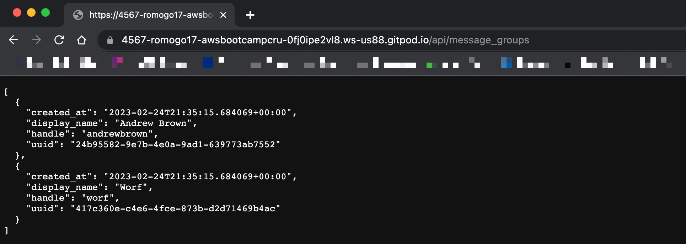


#### FRONTEND
```sh
# build
docker build -t frontend-react-js ./frontend-react-js

# run
docker run --rm -p 3000:3000 -d frontend-react-js
```

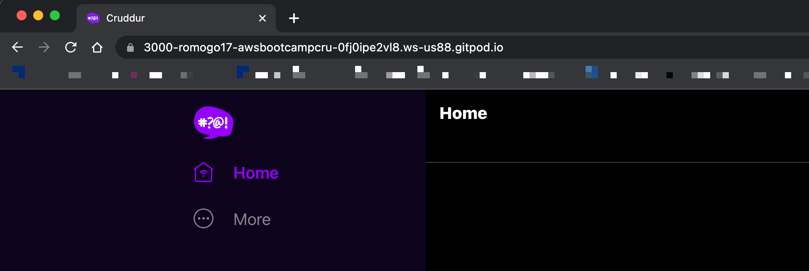


#### DOCKER COMPOSE

In our `docker-compose.yml` file, we're mounting directories with the local contents of the repos (`volumes`). If we don't have the required dependencies installed, our app won't run properly
```
cd backend-flask
pip3 install -r requirements.txt

cd frontend-react-js
npm install
```
Then,

```sh
docker compose up
```

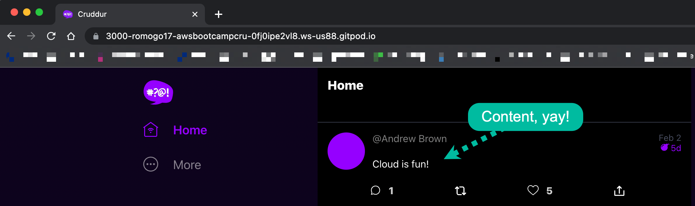

### OpenAPI Documentation for notifications endpoint
Completed the documentation of the notifications endpoint following the OpenAPI specification.

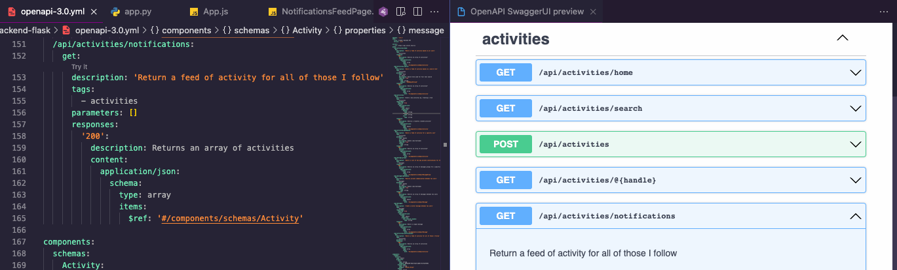

I'm glad we're using this! I had ussed swagger back then but hadn't played around with it in some time 😄

### Flask backend endpoint for notifications

Created the Flask backend endpoint for notifications
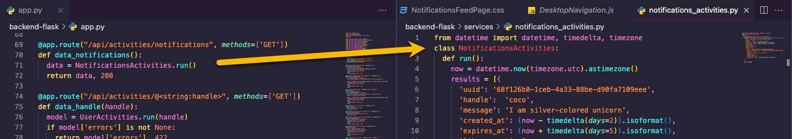

### React page for notifications

Created the React frontend page endpoint for notifications
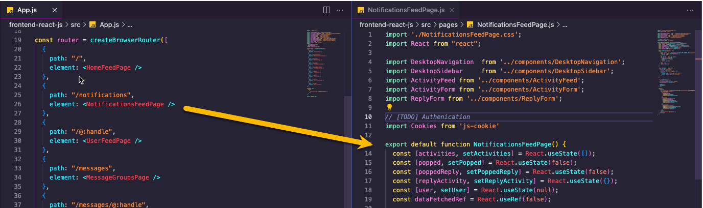

Which, when accessed, looks like this:
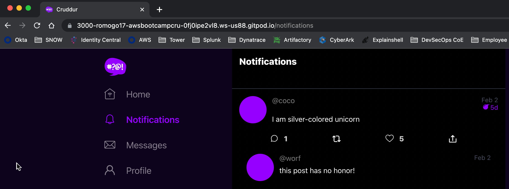

### DynamoDB Local container
Included the `dynamodb-local` container to the Docker Compose and tested it out

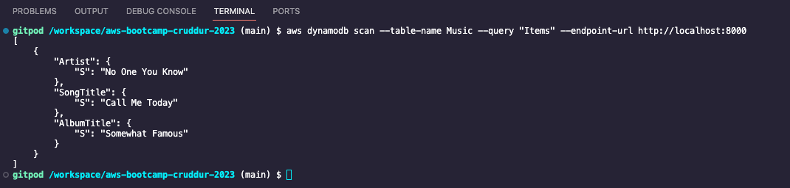

I really liked that we get to play around with DynamoDB local. This is something I've been meaning to do for some time but didn't have the excuse to do it 🚀


### PostgreSQL container
Included the `postgres` container to the Docker Compose and tested it out

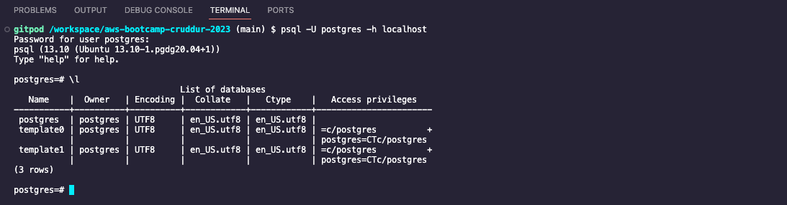

## Homework Challenges

### Run the Dockerfile CMDs as an external script
The default `ENTRYPOINT` for containers is `/bin/sh -c`, as such, it expects a command, not a script.

To have a script work, you need to change the entrypoint to something that accepts a script, like just a shell

```Dockerfile
ENTRYPOINT [ "/bin/sh" ]
CMD [ "docker-cmd.sh" ]
```

The issue with this is that the shell then becomes the init process (PID 1) in the container, so, unless the script handles it, the container will ignore `SIGINT` or `SIGTERM`

To overcome this issue, we need to use [`exec`](https://wiki.bash-hackers.org/commands/builtin/exec) in our script, so our application becomes PID 1 instead of the shell

```sh
#!/bin/bash
set -e
exec python3 -m flask run --host=0.0.0.0 --port=4567
```

### Push image to DockerHub
I already had a DockerHub account, so I just had to login from my terminal

```sh
$ docker login --username romogo17
Password:
Login Succeeded
```

Then I created a couple repositories
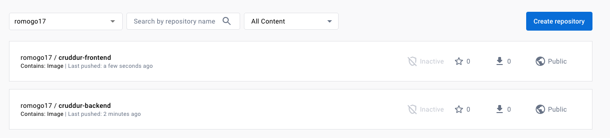

Then built my images with the correct tags/names

```
docker build -t romogo17/cruddur-backend ./backend-flask
docker build -t romogo17/cruddur-frontend ./frontend-react-js
```
And push them to DockerHub

```
docker push romogo17/cruddur-backend
docker push romogo17/cruddur-frontend
```

- https://hub.docker.com/r/romogo17/cruddur-frontend
- https://hub.docker.com/r/romogo17/cruddur-backend

### Use multistage Docker build
Multi stage Docker builds are all about ensuring images only have the minimum required software. For example, if you need to compile your sources, your final image doesn't need the compiler, so you build the image and then copy just the executable to a "fresh" base image.

In our case, this can be easily applied to the frontenv image, in which we build our React App, and then just serve the bundle with a web server (nginx). Included this Dockerfile:

```Dockerfile
FROM node:16.18 as builder

WORKDIR /frontend-react-js

COPY package*.json .
RUN npm install

COPY public ./public
COPY src ./src
RUN npm run build

FROM nginx
COPY nginx.conf /etc/nginx/nginx.conf
COPY --from=builder /frontend-react-js/build /usr/share/nginx/html
EXPOSE 80
RUN chown nginx.nginx /usr/share/nginx/html/ -R
```

Build and run with these commands:
```sh
# build
docker build -t frontend-react-js-prod -f ./frontend-react-js/Dockerfile.prod ./frontend-react-js

# run
docker run --rm -p 3000:80 -d frontend-react-js-prod
```

### Implement a healthcheck in the V3 Docker Compose file

I wasn't aware docker now had [`HEALTHCHECK` Dockerfile instruction](https://docs.docker.com/engine/reference/builder/#healthcheck). This was a pleasant surprise as this is something very useful in Kubernetes (although there, they're called _probes_ 😄)

This is the healthcheck I added to the backend service. For this to work, I also had to install `curl` in the backend image
```sh
healthcheck:
  test: ["CMD", "curl -X GET http://localhost:4567/api/activities/home -H 'Accept: application/json' -H 'Content-Type: application/json'"]
  interval: 30s
  timeout: 10s
  retries: 5
  start_period: 30s
```

This shows the container actually being healthy

```sh
$ docker ps --format "table {{.ID}}\t{{.Names}}\t{{.Status}}"

CONTAINER ID   NAMES                                           STATUS
6e57cfbaae1f   aws-bootcamp-cruddur-2023-db-1                  Up 54 seconds
57235eacd3ed   aws-bootcamp-cruddur-2023-frontend-react-js-1   Up 53 seconds
cfe0e773f535   aws-bootcamp-cruddur-2023-backend-flask-1       Up 53 seconds (healthy)
ad2271d7b4fc   dynamodb-local                                  Up 54 seconds

```
The healthcheck logs can be inspected like this:
```sh
docker inspect --format "{{json .State.Health }}" aws-bootcamp-cruddur-2023-backend-flask-1
```

### Best practices around Dockerfiles

### Install and run Docker in my local machine
I already had Docker Desktop installed. I used it to build and push the images to DockerHub. Here's a screenshot running both the backend and frontend images

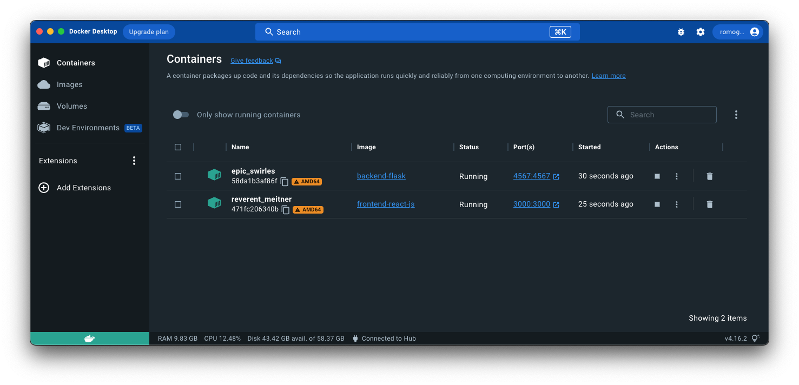

Something I can point out is that, since I have an M1 MacBook, there's a LOT of instances where I've found myself into weird issues when I build an image with the `linux/arm64` platform, but then run the container on a `linux/amd64` platform. Because of this, I have this environment variable setup in my shell

```
DOCKER_DEFAULT_PLATFORM=linux/amd64
```

### Run docker in an EC2 instance
