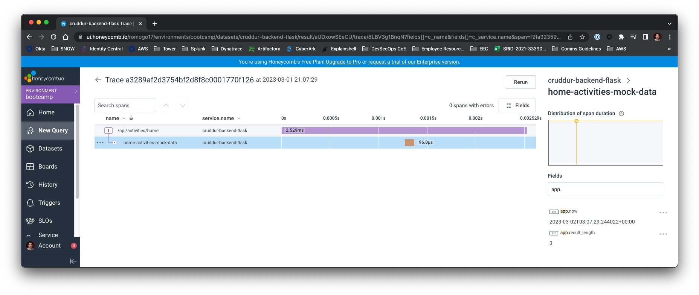
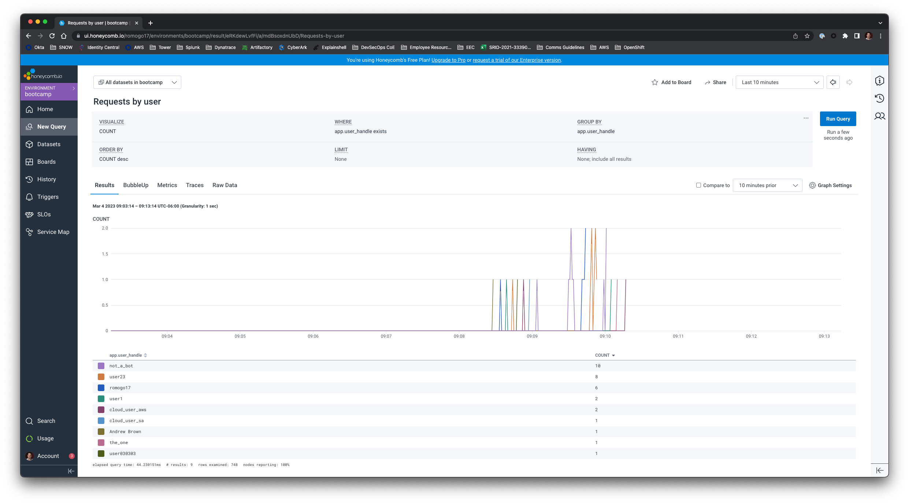

# Week 2 — Distributed Tracing

- [Week 2 — Distributed Tracing](#week-2--distributed-tracing)
  - [Required Homework](#required-homework)
    - [Instrument Honeycomb with OTEL](#instrument-honeycomb-with-otel)
    - [Instrument AWS X-Ray](#instrument-aws-x-ray)
    - [Configured a custom logger with CloudWatch Logs](#configured-a-custom-logger-with-cloudwatch-logs)
    - [Integrate an error and capture an error](#integrate-an-error-and-capture-an-error)
  - [Homework Challenges](#homework-challenges)
    - [Instrument Honeycomb for the frontend application (to observe network latency between frontend and backend)](#instrument-honeycomb-for-the-frontend-application-to-observe-network-latency-between-frontend-and-backend)
      - [OTEL COLLECTOR](#otel-collector)
      - [FRONTEND INSTRUMENTATION](#frontend-instrumentation)
    - [Add custom instrumentation to Honeycomb to add more attributes](#add-custom-instrumentation-to-honeycomb-to-add-more-attributes)
    - [Run custom queries in Honeycomb and save them later](#run-custom-queries-in-honeycomb-and-save-them-later)
      - [APP ACTIVE USERS](#app-active-users)
      - [LATENCY BY USER](#latency-by-user)
      - [REQUESTS BY USER](#requests-by-user)
      - [HONEYCOMB DASHBOARD](#honeycomb-dashboard)


## Required Homework
> **Note**: The following items are not documented here but already done through the student portal
> - I attended the Week 2 live stream
> - Watched both the Spending and Container Security Considerations and did the respective quizzes

### Instrument Honeycomb with OTEL
The Honeycomb instrumentation was done during the live session. For that one, we used the Open Telemetry libraries.



I want to point out, having done both Honeycomb and X-Ray at the time of writing, instrumenting for Honeycomb was much more intuitive and easy!

### Instrument AWS X-Ray
Completed the instrumentation with AWS X-Ray. The AWS resources we needed to create for it were created using Terraform.
The code for that is under [`./infrastructure/02-app`](./../infrastructure/02-app/).

I faced some issues instrumenting the `/api/activities/@handle` endpoint. For some reason the traces for it didn't show up at all in the console.
I ended up needing to start the segment like this and just rely on subsegments for the rest
```
try:
  xray_recorder.current_segment()
except:
  xray_recorder.begin_segment('user.activities')
```
After some troubleshooting I managed to get it working


When opening the trace I could also see the custom metadata added


### Configured a custom logger with CloudWatch Logs

Following the instructions provided in the video, configured custom logger to send logs to CloudWatch Logs


This was done with this commit ([`a055c35`](https://github.com/romogo17/aws-bootcamp-cruddur-2023/commit/a055c350a04667b78362fcfd016b77df25b2ef3d)) but later on commented to save on costs

### Integrate an error and capture an error

I found the integration with Rollbar as easy as the one with Honeycomb. Very intuitive :smile:


## Homework Challenges

### Instrument Honeycomb for the frontend application (to observe network latency between frontend and backend)

Instrumenting the frontend follows two high level steps:
1. Setup an Open Telemetry (OTEL) Collector. The collector will listen for the traces, and, through a pipeline, send them to the HoneyComb backend
2. Instrument the frontend application

#### OTEL COLLECTOR

<p align="center">
  
</p>

In the [HoneyComb documentation](https://docs.honeycomb.io/getting-data-in/otel-collector/#running-the-collector) for the Open Telemetry Collector, I found an example of how to run the collector with Docker

```sh
docker run \
  -p 14268:14268 \
  -p 4317-4318:4317-4318 \
  -v $(pwd)/otel_collector_config.yaml:/etc/otelcol/config.yaml \
  otel/opentelemetry-collector:latest

```
Also in the official [Open Telemetry documentation](https://opentelemetry.io/docs/collector/getting-started/) for the collector, there's an example on how to run it in Docker Compose. After doing a few tweaks this is how it looks

```yaml
  otel-collector:
    image: otel/opentelemetry-collector
    command: [--config=/etc/otel-collector-config.yaml]
    environment:
      HTTP_FRONTEND_URL: "http://3000-${GITPOD_WORKSPACE_ID}.${GITPOD_WORKSPACE_CLUSTER_HOST}"
      HTTPS_FRONTEND_URL: "https://3000-${GITPOD_WORKSPACE_ID}.${GITPOD_WORKSPACE_CLUSTER_HOST}"
      HONEYCOMB_API_KEY: "${HONEYCOMB_API_KEY}"
    volumes:
      - ./frontend-react-js/otel-collector-config.yaml:/etc/otel-collector-config.yaml
    ports:
      - 4318:4318 # OTLP http receiver
```

The collector also needs some configuration (trace pipeline), which was defined as follows:

```yaml
receivers:
  otlp:
    protocols:
      http:
        endpoint: "0.0.0.0:4318"
        cors:
          allowed_origins:
            - ${env:HTTP_FRONTEND_URL}
            - ${env:HTTPS_FRONTEND_URL}

processors:
  batch:
exporters:
  otlp/honeycomb:
    endpoint: "api.honeycomb.io:443"
    headers:
      "x-honeycomb-team": ${env:HONEYCOMB_API_KEY}

service:
  pipelines:
    traces:
      receivers: [otlp]
      processors: [batch]
      exporters: [otlp/honeycomb]
```

#### FRONTEND INSTRUMENTATION
For the frontend implementation, we need to define an environment variable for the OTEL Collector. I got stuck with this for some time because I wasn't aware that the environment variables for applications created with `create-react-app` need to be prefixed with `REACT_APP_` ([documentation on environment variables](https://create-react-app.dev/docs/adding-custom-environment-variables/)).

This was very puzzling to me because duing troubleshooting, I always got `undefined` values until I found this gotcha!

Another issue when setting this up was with CORS, the backend had to be tweaked just a bit to allow the `traceparent` header

```diff
  cors = CORS(
    app,
    resources={r"/api/*": {"origins": origins}},
    expose_headers="location,link",
-   allow_headers="content-type,if-modified-since",
+   allow_headers=["Content-Type", "if-modified-since", "traceparent"],
    meth
  )
```

Other than these gotchas, the frontend was instrumented following the instructions in the [Honeycomb documentation](https://docs.honeycomb.io/getting-data-in/opentelemetry/browser-js/)

I could see both the frontend and the backend datasets


And I could also see the traces going from the frontend to the backend


### Add custom instrumentation to Honeycomb to add more attributes

For this homework challenge, I instrumented each and every backend endpoint, added a custom span for the mock data of each and added attributes for the `user_handle` where relevant

- [`d2527181`](https://github.com/romogo17/aws-bootcamp-cruddur-2023/commit/d252718e35c3271d825062f3d907b152bb2c562d) instrumented `create_activity`
- [`158d82f1`](https://github.com/romogo17/aws-bootcamp-cruddur-2023/commit/158d82f07efd0f8601a11ed177e1d45c2f344f5d) instrumented `create_message`
- [`f3974101`](https://github.com/romogo17/aws-bootcamp-cruddur-2023/commit/f397410a16700306fba8a2c40a8aeeb993ad9325) instrumented `create_reply`
- [`2ee3cf21`](https://github.com/romogo17/aws-bootcamp-cruddur-2023/commit/2ee3cf2aa40b64ef8c2550fa47160a4388c3d208) instrumented `message_groups`
- [`b227ead1`](https://github.com/romogo17/aws-bootcamp-cruddur-2023/commit/b227ead7a0da6a322511556d19b646afae9eb56f) instrumented `messages`
- [`84939301`](https://github.com/romogo17/aws-bootcamp-cruddur-2023/commit/8493930bb1b6a345215d28bd600a412b4bd7b6c4) instrumented `notifications_activities`
- [`d5e34081`](https://github.com/romogo17/aws-bootcamp-cruddur-2023/commit/d5e3408eed2f1060e35d7087338ea7dd03987aef) instrumented `search_activities`
- [`237677a1`](https://github.com/romogo17/aws-bootcamp-cruddur-2023/commit/237677a9d41f7ee484aeaa7ec906ea142d4180d2) instrumented `show_activity`
- [`7344fb8`](https://github.com/romogo17/aws-bootcamp-cruddur-2023/commit/7344fb800beef6904dbf6b0878dfde9b6ca9325c) instrumented `user_activities`


This means that every single frontend fetch request (which are now instruented), should have the corresponding backend data instrumented as well.

### Run custom queries in Honeycomb and save them later

I spent some time playing around with the data I had instrumented, and came up with the following interesting queries

#### APP ACTIVE USERS
Shows how many different active users interact with Cruddur on a given timeframe


#### LATENCY BY USER
Shows the latency of the requests grouped by users


#### REQUESTS BY USER
Shows the count of requests by user, can tell us which users are more active in the app


---

The saved queries can be accessed in the History menu, under My Saved Queries. However, I found it better to create a dashboard with all the queries

#### HONEYCOMB DASHBOARD
