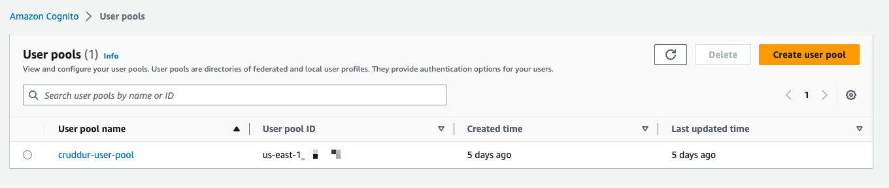
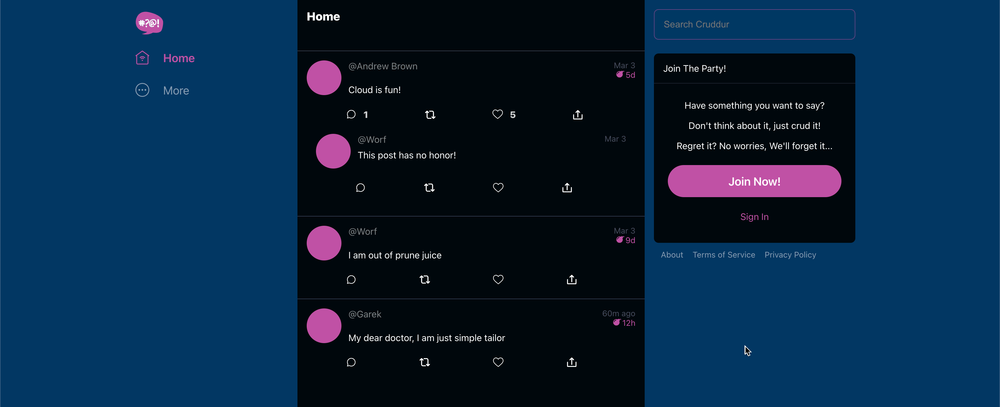
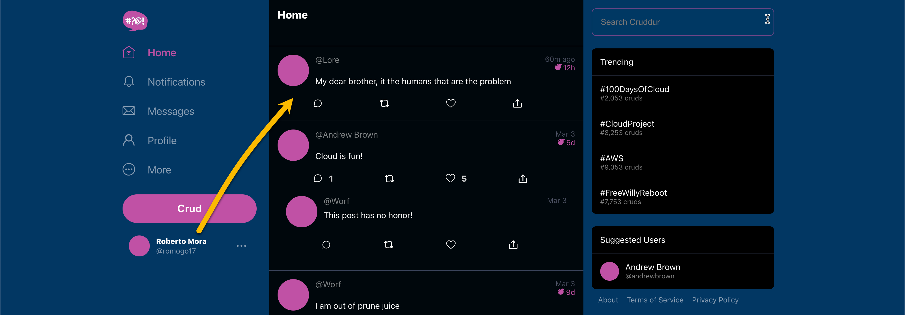

# Week 3 — Decentralized Authentication

- [Week 3 — Decentralized Authentication](#week-3--decentralized-authentication)
  - [Required Homework](#required-homework)
    - [Setup a Cognito User Pool](#setup-a-cognito-user-pool)
    - [Updated the frontend stypes to improve the contrast](#updated-the-frontend-stypes-to-improve-the-contrast)
    - [Custom Signin, Signup, Confirmation and Recovery Pages](#custom-signin-signup-confirmation-and-recovery-pages)
  - [Homework Challenges](#homework-challenges)
    - [Cognito Identity Pool and Identity Pool Client created through Terraform](#cognito-identity-pool-and-identity-pool-client-created-through-terraform)
  - [Class Notes](#class-notes)
    - [Intro](#intro)

## Required Homework
> **Note**: The following items are not documented here but already done through the student portal
> - I attended the Week 3 live stream
> - Watched both the Spending and Container Security Considerations and did the respective quizzes
> - Watched the video about different approached to verify JWTs

### Setup a Cognito User Pool
I followed along during the livestream, however, as en extra challenge, I created my final user pool through Terraform, this is explained further in the first Homework Challenge [below](#cognito-identity-pool-and-identity-pool-client-created-through-terraform)



### Updated the frontend stypes to improve the contrast
Updated the styles of the project to use CSS variables across the whole page. All of the color changes are controlled by CSS variables



### Custom Signin, Signup, Confirmation and Recovery Pages
All of the custom pages for the whole authentication flow were implemented following the instructional videos, for instance, if an error is encountered during login, said error is shown in the UI


When the authentication is successful, the user information is shown in the UI, and the additional mock data that is only returned by the backend when users are authenticated is also returned




## Homework Challenges

### Cognito Identity Pool and Identity Pool Client created through Terraform
The very first thing I did once the livestream was over was to re-create the Cognito Identity pool using Terraform. Part of my goals to push myself and try to get Red Squad is to ensure everything in AWS is deployed through Terraform.
Not only this but I found the process of creating the Identity Pool a bit overwhelming and error prone, which is the perfect scenario to automate it!

I found translating the console content to Terraform a bit difficult, so what I did was to describe the current Identity Pool and Identity Pool Client using the AWS CLI, using the following commands

```sh
aws cognito-idp \
  describe-user-pool \
  --user-pool-id "us-east-1_AAABBBCCC" > user-pool.json

aws cognito-idp \
  describe-user-pool-client \
  --user-pool-id "us-east-1_AAABBBCCC" \
  --client-id "abc123abc123"  > user-pool-client.json
```

I then used the output to map the values to Terraform's [`cognito_user_pool`](https://registry.terraform.io/providers/hashicorp/aws/latest/docs/resources/cognito_user_pool) and [`cognito_user_pool_client`](https://registry.terraform.io/providers/hashicorp/aws/latest/docs/resources/cognito_user_pool_client) resources. After deploying the resources I followed the same approach to describe them and diff them agains the Identity Pool and Identity Pool Client created manually

## Class Notes
### Intro