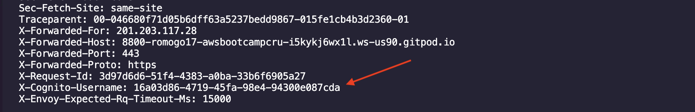

# Week 3 — Decentralized Authentication

- [Week 3 — Decentralized Authentication](#week-3--decentralized-authentication)
  - [Required Homework](#required-homework)
    - [Setup a Cognito User Pool](#setup-a-cognito-user-pool)
    - [Updated the frontend stypes to improve the contrast](#updated-the-frontend-stypes-to-improve-the-contrast)
    - [Custom Signin, Signup, Confirmation and Recovery Pages](#custom-signin-signup-confirmation-and-recovery-pages)
  - [Homework Challenges](#homework-challenges)
    - [Cognito Identity Pool and Identity Pool Client created through Terraform](#cognito-identity-pool-and-identity-pool-client-created-through-terraform)
    - [Decouple the JWT verification using both **Envoy** and a sidecar container using the `aws-jwt-verify` library](#decouple-the-jwt-verification-using-both-envoy-and-a-sidecar-container-using-the-aws-jwt-verify-library)
      - [THE ENVOY PROXY](#the-envoy-proxy)
      - [THE AUTHZ APP](#the-authz-app)
      - [BAKCEND CHANGES](#bakcend-changes)
      - [FRONTEND CHANGES](#frontend-changes)
      - [DOCKER COMPOSE](#docker-compose)

## Required Homework
> **Note**: The following items are not documented here but already done through the student portal
> - I attended the Week 3 live stream
> - Watched both the Spending and Container Security Considerations and did the respective quizzes
> - Watched the video about different approached to verify JWTs

### Setup a Cognito User Pool
I followed along during the livestream, however, as en extra challenge, I created my final user pool through Terraform, this is explained further in the first Homework Challenge [below](#cognito-identity-pool-and-identity-pool-client-created-through-terraform)


### Updated the frontend stypes to improve the contrast
Updated the styles of the project to use CSS variables across the whole page. All of the color changes are controlled by CSS variables


### Custom Signin, Signup, Confirmation and Recovery Pages
All of the custom pages for the whole authentication flow were implemented following the instructional videos, for instance, if an error is encountered during login, said error is shown in the UI


When the authentication is successful, the user information is shown in the UI, and the additional mock data that is only returned by the backend when users are authenticated is also returned


## Homework Challenges

### Cognito Identity Pool and Identity Pool Client created through Terraform
The very first thing I did once the livestream was over was to re-create the Cognito Identity pool using Terraform. Part of my goals to push myself and try to get Red Squad is to ensure everything in AWS is deployed through Terraform.
Not only this but I found the process of creating the Identity Pool a bit overwhelming and error prone, which is the perfect scenario to automate it!

I found translating the console content to Terraform a bit difficult, so what I did was to describe the current Identity Pool and Identity Pool Client using the AWS CLI, using the following commands

```sh
aws cognito-idp \
  describe-user-pool \
  --user-pool-id "us-east-1_AAABBBCCC" > user-pool.json

aws cognito-idp \
  describe-user-pool-client \
  --user-pool-id "us-east-1_AAABBBCCC" \
  --client-id "abc123abc123"  > user-pool-client.json
```

I then used the output to map the values to Terraform's [`cognito_user_pool`](https://registry.terraform.io/providers/hashicorp/aws/latest/docs/resources/cognito_user_pool) and [`cognito_user_pool_client`](https://registry.terraform.io/providers/hashicorp/aws/latest/docs/resources/cognito_user_pool_client) resources. After deploying the resources I followed the same approach to describe them and diff them against the Identity Pool and Identity Pool Client created manually.

The code can be found under [`infrastructure/02-app/cognito.tf`](../infrastructure/02-app/cognito.tf)

### Decouple the JWT verification using both **Envoy** and a sidecar container using the `aws-jwt-verify` library

As my main homework challenge of the week, I decided to combine two of the hard challenges into one. I implemented a solution to decouple the JWT verification that uses both the Envoy proxy and a Node.js sidecar that uses the `aws-jwt-verify` library.
In a nutshell, Envoy calls an external authorization provider (the Node.js sidecar) and depending on the aurhotization result, it either allows the request or not.

I had never used Envoy before so it was definitely challenging! All of the changes are in this commit: [`5bdb253`](https://github.com/romogo17/aws-bootcamp-cruddur-2023/commit/5bdb253832f4d04edcaa8b38fb937bd51eed50bb). Here are the steps I followed to implement this.

#### THE ENVOY PROXY

Below is the Envoy proxy configuration. The `clusters` section defines the services Envoy knows about, and under `filter_chains.http_filters` we can find how Envoy manages the traffic. The External Authorization service (aka, my Node.js app) is the `envoy.filters.http.ext_authz` filter :smile:

```yaml
static_resources:
  listeners:
  - address:
      socket_address:
        address: 0.0.0.0
        port_value: 8800
    filter_chains:
    - filters:
      - name: envoy.filters.network.http_connection_manager
        typed_config:
          "@type": type.googleapis.com/envoy.extensions.filters.network.http_connection_manager.v3.HttpConnectionManager
          codec_type: AUTO
          stat_prefix: ingress_http
          route_config:
            name: local_route
            virtual_hosts:
            - name: service
              domains:
              - "*"
              routes:
              - match:
                  prefix: "/api"
                route:
                  cluster: backend-flask
          http_filters:
          - name: envoy.filters.http.ext_authz
            typed_config:
              "@type": type.googleapis.com/envoy.extensions.filters.http.ext_authz.v3.ExtAuthz
              http_service:
                server_uri:
                  uri: authz:8123
                  cluster: authz
                  timeout: 5s
                authorization_response:
                  allowed_upstream_headers:
                    patterns:
                      - exact: x-cognito-username
          - name: envoy.filters.http.router
            typed_config:
              "@type": type.googleapis.com/envoy.extensions.filters.http.router.v3.Router
  clusters:
  - name: backend-flask
    connect_timeout: 5s
    type: STRICT_DNS
    lb_policy: ROUND_ROBIN
    load_assignment:
      cluster_name: backend-flask
      endpoints:
      - lb_endpoints:
        - endpoint:
            address:
              socket_address:
                address: backend-flask
                port_value: 4567
  - name: authz
    connect_timeout: 5s
    type: strict_dns
    lb_policy: round_robin
    load_assignment:
      cluster_name: backend-flask
      endpoints:
      - lb_endpoints:
        - endpoint:
            address:
              socket_address:
                address: authz
                port_value: 8123
admin:
  access_log_path: "/dev/null"
  address:
    socket_address:
      address: 0.0.0.0
      port_value: 8001
```

#### THE AUTHZ APP
The Node.js authorization app is defined below, it uses the `aws-jwt-verify` library to verify the JWTs. If the JWT is valid, it adds a `x-cognito-username` Header to the request to the backend.

If the JWT is not valid, it doesn't reject the request, it just doesn't add a `x-cognito-username` Header. This is handled by the backend

```js
const { CognitoJwtVerifier } = require("aws-jwt-verify");
const express = require("express");
const app = express()
const port = 8123

// Create the verifier outside your route handlers,
// so the cache is persisted and can be shared amongst them.
const jwtVerifier = CognitoJwtVerifier.create({
  userPoolId: process.env.AWS_COGNITO_USER_POOL_ID,
  clientId: process.env.AWS_COGNITO_USER_POOL_CLIENT_ID,
  tokenUse: "access",
});

app.get("*", async (req, res, next) => {
  try {
    const authHeader = req.header("authorization")
    let payload

    if (authHeader && authHeader.split(' ')[0] === 'Bearer') {
      payload = await jwtVerifier.verify(authHeader.split(' ')[1]);
    } else {
      payload = await jwtVerifier.verify(authHeader);
    }

    console.log("Token is valid. Payload: ", payload)
    res.append('x-cognito-username', payload.username).json({Status: "Ok"});
  } catch (err) {
    console.error(err);
    return res.status(200).end()
  }
});

// Hydrate the JWT verifier, then start express.
// Hydrating the verifier makes sure the JWKS is loaded into the JWT verifier,
// so it can verify JWTs immediately without any latency.
// (Alternatively, just start express, the JWKS will be downloaded when the first JWT is being verified then)
jwtVerifier
  .hydrate()
  .catch((err) => {
    console.error(`Failed to hydrate JWT verifier: ${err}`);
    process.exit(1);
  })
  .then(() =>
    app.listen(port, () => {
      console.log(`Example app listening at http://localhost:${port}`);
    })
  );
```

#### BAKCEND CHANGES

As stated before, the backend doesn't need to do any JWT verification, just handle the `x-cognito-username` Header, which is added by the External Authorization service

```py
@app.route("/api/activities/home", methods=['GET'])
def data_home():
  cognito_username = request.headers.get("X-Cognito-Username", None)
  if cognito_username != None:
    data = HomeActivities.run(cognito_user_id=cognito_username)
  else:
    data = HomeActivities.run()
  return data, 200
```



#### FRONTEND CHANGES

For the frontend, instead of calling our backend, we call our Envoy proxy

```diff
-     const backend_url = `${process.env.REACT_APP_BACKEND_URL}/api/activities/home`
+     const backend_url = `${process.env.REACT_APP_ENVOY_URL}/api/activities/home`
      const res = await fetch(backend_url, {
        method: "GET",
        headers: {
          Authorization: `Bearer ${localStorage.getItem("access_token")}`
        }
      });
```

#### DOCKER COMPOSE

Last but not least, I added the `envoy` and `authz` services to the `docker-compose.yml` file plus a couple environment variables that pass wht Envoy URL to the frontend

```yml
  envoy:
    build: ./envoy
    ports:
      - "8800:8800"
      - "8081:8001"
    volumes:
      - ./envoy/envoy.yaml:/etc/envoy/envoy.yaml
  authz:
    build: ./cognito-authz
    expose:
      - "8123"
    ports:
      - "8123:8123"
    environment:
      AWS_COGNITO_USER_POOL_ID: "${AWS_USER_POOLS_ID}"
      AWS_COGNITO_USER_POOL_CLIENT_ID: "${AWS_USER_POOLS_WEB_CLIENT_ID}"
```
