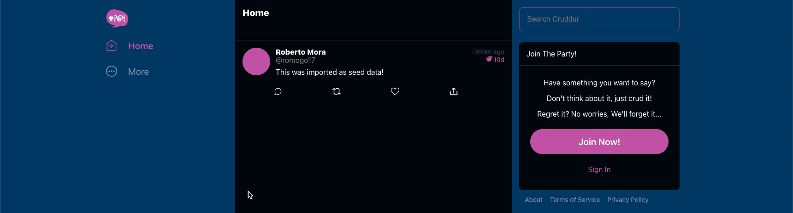
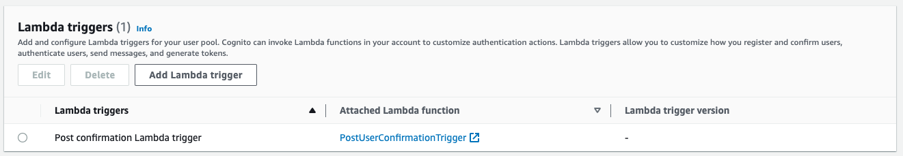
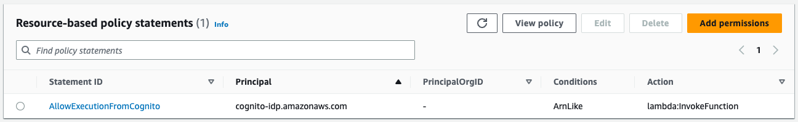
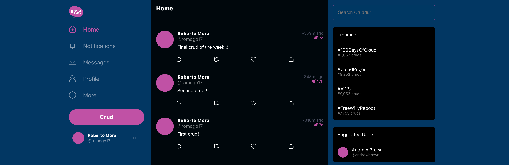

# Week 4 — Postgres and RDS

- [Week 4 — Postgres and RDS](#week-4--postgres-and-rds)
  - [Required Homework](#required-homework)
    - [Install Postgres Driver in Backend Application](#install-postgres-driver-in-backend-application)
    - [Create Cognito Trigger to insert user into database](#create-cognito-trigger-to-insert-user-into-database)
    - [Create new activities with a database insert](#create-new-activities-with-a-database-insert)
  - [Homework Challenges](#homework-challenges)
    - [Database design improvement](#database-design-improvement)
    - [Create the RDS instance using Terraform](#create-the-rds-instance-using-terraform)
    - [Improved DB library logging](#improved-db-library-logging)
    - [Removed hardcoded user handle when creating activities](#removed-hardcoded-user-handle-when-creating-activities)

## Required Homework
> **Note**: The following items are not documented here but already done through the student portal
> - I attended the Week 4 live stream, in which we created the RDS instance and a couple bash scripts
> - Watched the Security Considerations video and did the respective quiz

### Install Postgres Driver in Backend Application
I watched and followed the video to connect the backend to both the container DB and the remote DB running in AWS

As a result, I was able to remove the mock data from the Home Activities page and return results coming from the DB



> **Note**: Connecting Gitpod to RDS instance was done as a part of this task

### Create Cognito Trigger to insert user into database

I created the Cognito trigger fully through automation, using a combination of Terraform (since I had already created my User Pool through Terraform) and AWS SAM

The Terraform updates are located here [`infrastructure/02-app/cognito.tf`](../infrastructure/02-app/cognito.tf), in a nutshell I just had to:
* Update the user pool configuration to add the `lambda_config`
  
* Create a `aws_lambda_permission` resource so that the `cognito-idp.amazonaws.com` principal has permissions to invoke our lambda. This is done automatically when we use the console, but we must do it explicitly when using automation.
  

The AWS SAM template is located here [`infrastructure/03-lambdas/template.yaml`](../infrastructure/03-lambdas/template.yaml), a couple highlights are that:
* I'm using the [`aws_lambda_powertools`](https://awslabs.github.io/aws-lambda-powertools-python/) for logging
* I'm leveraging my `sam build` to bundle the `psycopg2-binary` package instead of using an untrusted layer

After both of these, the post confirmation user trigger worked as expected and I could see the rows being inserted in the `users` table.
```
cruddur=> select * from users;
                 uuid                 | display_name |  handle  |       email        |           cognito_user_id            |         created_at
--------------------------------------+--------------+----------+--------------------+--------------------------------------+----------------------------
 6fc02b94-6834-455b-b301-e88c444ffdfc | Roberto Mora | romogo17 | romogo17@gmail.com | dd85735c-5e1a-417a-8952-8a834d4c991a | 2023-03-16 03:13:55.639628
(1 row)

```

### Create new activities with a database insert
I followed along to create new activities with a database insert. I feel very comfortable around databases (worked as a Database Design Teaching Assistant once) so I really enjoyed this week.

I really like how we worked directly with SQL instead of using and ORM and how we stored the SQL templates in SQL files directly (to avoid embedding SQL in the code)



After completing all the work, I was able to create activities and having these activities stored and queried from the RDS DB

```
cruddur=> select uuid, user_uuid, message, expires_at, created_at from activities;
                 uuid                 |              user_uuid               |          message          |         expires_at         |         created_at
--------------------------------------+--------------------------------------+---------------------------+----------------------------+----------------------------
 6a5cd1ef-4cd4-473b-ad37-09382d315362 | c7c0825a-c188-4353-a9fd-11f9ab633f12 | First crud!               | 2023-03-24 21:39:23.092082 | 2023-03-17 21:39:23.126733
 405b4495-e4f9-4d34-9749-ee6eb0c19c71 | c7c0825a-c188-4353-a9fd-11f9ab633f12 | Second crud!!!            | 2023-03-18 10:06:49.455182 | 2023-03-17 22:06:49.491112
 3c5fb252-ea59-4571-98db-1b591450b754 | c7c0825a-c188-4353-a9fd-11f9ab633f12 | Final crud of the week :) | 2023-03-24 22:22:24.730648 | 2023-03-17 22:22:24.765982
(3 rows)
```

As a challenge, I improved the code in a couple ways (documented below):
- [Improved DB library logging](#improved-db-library-logging)
- [Removed hardcoded user handle when creating activities](#removed-hardcoded-user-handle-when-creating-activities)

## Homework Challenges

### Database design improvement

I added a small improvement to the activities schema, which is a foreign key to the users dable

```diff
  CREATE TABLE public.activities (
    uuid UUID DEFAULT uuid_generate_v4() PRIMARY KEY,
    user_uuid UUID NOT NULL,
    message text NOT NULL,
    replies_count integer DEFAULT 0,
    reposts_count integer DEFAULT 0,
    likes_count integer DEFAULT 0,
    reply_to_activity_uuid integer,
    expires_at TIMESTAMP,
    created_at TIMESTAMP default current_timestamp NOT NULL,
+   CONSTRAINT fk_user_uuid
+       FOREIGN KEY(user_uuid)
+       REFERENCES users(uuid)
  );
```

### Create the RDS instance using Terraform
I followed along during the livestream, however, as en extra challenge, I created my final RDS instance through Terraform

The code can be found under [`infrastructure/02-app/rds.tf`](../infrastructure/02-app/rds.tf)

### Improved DB library logging
It was very frustrating to use `print` within the DB library, because `print` wouldn't initially flush to `stdout` immediately.

This could be worked around by using `print(..., flush=True)`, but this didn't seem like the way to go.
As such, since we were already importing the current Flask app, we could replace the print calls with just the app logging.

```py
from flask import current_app as app

...

app.logger.info(f'{cyan}SQL STATEMENT---[{title}]---{no_color}\n{sql}\n')
```

### Removed hardcoded user handle when creating activities
When working on the create activities app, I got an error about violating a NOT NULL constraint in the activities table

```sql
CREATE TABLE public.activities (
  uuid UUID DEFAULT uuid_generate_v4() PRIMARY KEY,
  user_uuid UUID NOT NULL,                              -- This NOT NULL constraint
  ...
```

After doing some troubleshooting, I noticed that the insert statement was searching for the `user_uuid` based on the user `handle`

```sql
INSERT INTO public.activities (
  user_uuid,
  message,
  expires_at
)
VALUES (
  (SELECT uuid                                          -- ----
    FROM public.users                                   --
    WHERE users.handle = %(handle)s                     -- HERE
    LIMIT 1                                             --
  ),                                                    -- ----
  %(message)s,
  %(expires_at)s
) RETURNING uuid;
```

This value was hardcoded in `app.py`
```py
@app.route("/api/activities", methods=['POST','OPTIONS'])
@cross_origin()
def data_activities():
  user_handle  = 'andrewbrown'                          # HERE
  ...
```
In order to fix it, I passed the `user` as a prop to the `ActivityForm` in the `HomeFeedPage.js`

```jsx
        <ActivityForm
          user={user}                                   // HERE
          popped={popped}
          ...
```

With this, when `ActivityHome` calls the backend, it can send the handle of the authenticated user

```jsx
        body: JSON.stringify({
          handle: props.user.handle,                    // HERE
          message: message,
          ttl: ttl
        }),
```

Which can be consumed by the backend
```diff
  @app.route("/api/activities", methods=['POST','OPTIONS'])
  @cross_origin()
  def data_activities():
-   user_handle  = 'andrewbrown'
+   user_handle = request.json['handle']
    ...
```
With that, new activities created are associated to the logged in user :smile: