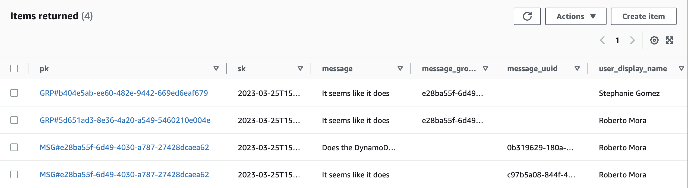

# Week 5 — DynamoDB and Serverless Caching

- [Week 5 — DynamoDB and Serverless Caching](#week-5--dynamodb-and-serverless-caching)
  - [Required Homework](#required-homework)
    - [Implement Dynamo DB scripts](#implement-dynamo-db-scripts)
    - [Implement Update Cognito ID Script for Postgres Database](#implement-update-cognito-id-script-for-postgres-database)
    - [Implement the Access Patterns](#implement-the-access-patterns)
  - [Homework Challenges](#homework-challenges)
    - [Suggestion for pattern E: Updating a Message Group using DynamoDB Streams](#suggestion-for-pattern-e-updating-a-message-group-using-dynamodb-streams)
    - [Infrastructure as Code](#infrastructure-as-code)
      - [Dynamo DB infrastructure](#dynamo-db-infrastructure)
      - [Stream processing lambda](#stream-processing-lambda)
  - [Notes](#notes)

## Required Homework

### Implement Dynamo DB scripts

I implemented all of the DynamoDB utility scripts. This was pretty straightforward. For the python ones, I did an improvement in the way we're parsing the prod flag, by using python's built-in `argparse` library

```py
import argparse

parser = argparse.ArgumentParser()
parser.add_argument("--prod", default=False, action="store_true")
args = parser.parse_args()
attrs = {} if args.prod is True else {"endpoint_url": "http://localhost:8000"}
```

These were the scripts implemented:

- Schema Load Script
  - I ended up replacing this with my Terraform infrastructure but more on that in the challenges section
- Seed Script
- Scan Script
- Pattern Scripts for Read and List Conversations


### Implement Update Cognito ID Script for Postgres Database

I followed along to implement the `db-update-cognito-user-ids` script.

I had already done some fixes for this during the previous week. What I had done is that my seed data already had the cognito user IDs included, but having this in a script is also useful.

### Implement the Access Patterns

This was by far what took me the longest to complete. Something that took me a lot of time is that **I ran out of GitPod credits**, so I had to spend a significant amount of time getting my Codespaces environment ready!

I feel Codespaces slower, but I managed to solve a few other painpoints I had with GitPod for good (such as some tools not being available when reconnecting to an expired GitPod). I'm good with Codespaces overall.

The implementation of all the access patterns was similar:
1. Update the frontend to send the correct data and send the access token
2. Update the Flask app endpoint
3. Update the underlying service
4. Update the DB layer

Something different in my case is that I'm using an **Envoy sidecar** for authorization. So the boilerplate for authorizing users to endpoints is a bit easier

```py
def api_endpoint():
    # this header is populated by the external authorization service
    cognito_username = request.headers.get("X-Cognito-Username", None)

    # ... extract needed variables from the request body ...

    if cognito_username is not None:
        # ... do stuff for authenicatied request ...
    else:
        # unauthenicatied request
        return {}, 401
```

These were the access patterns implemented
- **Pattern A**: Listing Messages in Message Group into Application
- **Pattern B**: Listing Messages Group into Application
- **Pattern C**: Creating a Message for an existing Message Group into Application
- **Pattern D**: Creating a Message for a new Message Group into Application
- **Pattern E**: Updating a Message Group using DynamoDB Streams




## Homework Challenges

### Suggestion for pattern E: Updating a Message Group using DynamoDB Streams

I think the lambda that processes the DynamoDB stream needs an update. In the `ddb.py` library, under the `create_message_group` method, we're making use of `client.batch_write_item(RequestItems=items)`

This means that even though we're have the trigger configured with a batch of 1, during this insert, our event includes multuple records:


And our code for this is only processing index `0`

### Infrastructure as Code
As usual, one of my challenges across the whole bootcamp is to make sure everything is deployed through code. For this week, this involves:

#### Dynamo DB infrastructure

The DynamoDB table, the VPC endpoint, and stream trigger were deployed using Terraform

The code can be found here: [`infrastructure/02-app/dynamodb.tf`](../infrastructure/02-app/dynamodb.tf)

#### Stream processing lambda

Similar to the lambda that we created last time, the new lambda to process the DynamoDB stream was created using AWS SAM, the code for which can be found here: [`infrastructure/03-lambdas/template.yaml`](../infrastructure/03-lambdas/template.yaml)

## Notes

- DynamoDB modeling [diagram](https://www.youtube.com/redirect?event=live_chat&redir_token=QUFFLUhqbWpFbEtaMWdtV25vWldUWlBhZDl2OHp3OVdMQXxBQ3Jtc0ttNHVGS3BUSU1xbk1zMV9uNC1ua2ctbGJNc0JnMmJmRDJlZG8tVWFaS0hCbkdpR3RfeWhvUnl1dENwaXJ6cHFXVkZQam8zMGktcGtPUEhMS1o2Yng5TjViREFOb29VVWJNelUtN0N2WnNqQmEyMHdYcw&q=https%3A%2F%2Flucid.app%2Flucidchart%2F8f58a19d-3821-4529-920f-5bb802d6c6a3%2Fedit%3Fviewport_loc%3D2163%252C508%252C2219%252C1161%252C0_0%26invitationId%3Dinv_e47bc316-9caa-4aee-940f-161e01e22715)