# Week 6 — Deploying Containers

- [Week 6 — Deploying Containers](#week-6--deploying-containers)
  - [Required Homework](#required-homework)
    - [Fargate cluster, ECR repos and backend service](#fargate-cluster-ecr-repos-and-backend-service)
    - [Load balancer, listeners, target groups, envoy, frontend, custom domain, SSL](#load-balancer-listeners-target-groups-envoy-frontend-custom-domain-ssl)
    - [Amazon Cognito refresh token](#amazon-cognito-refresh-token)
    - [Refactor `bin/` directory](#refactor-bin-directory)
    - [XRay and container insights](#xray-and-container-insights)
  - [Homework Challenges](#homework-challenges)
    - [Issues with Envoy and Service Connect](#issues-with-envoy-and-service-connect)
    - [Improving the security of the backend (IAM)](#improving-the-security-of-the-backend-iam)
    - [Use of `async/await` in `getAccessToken()`](#use-of-asyncawait-in-getaccesstoken)
    - [Enabled Honeycomb tracing for the frontend](#enabled-honeycomb-tracing-for-the-frontend)


## Required Homework

This couple weeks have been quite a bit of work for me. Particularly because, since I've been doing the homework challenges during the previous weeks, this meant that I had to implement much more this week, mostly on my own.

Some of the challenges I had because of this are explained in the [Homework Challenges](#homework-challenges) section

As usual, I've been doing everything in this bootcamp through infrastructure as code, which means all of the following were deployed through Terraform

- ECS cluster
- ECS services
- ECS task definitions
- Security Groups
- Load Balancer
- Listeners
- Forward Rules
- Target groups
- SSL certificates and their verification
- DNS records

The code for all of this can be found under [`infrastructure/02-app/`](../infrastructure/02-app/), primarily in the following files:

- [`infrastructure/02-app/ecr.tf`](../infrastructure/02-app/ecr.tf)
- [`infrastructure/02-app/ecs.tf`](../infrastructure/02-app/ecs.tf)
- [`infrastructure/02-app/dns.tf`](../infrastructure/02-app/dns.tf)
- [`infrastructure/02-app/iam.tf`](../infrastructure/02-app/iam.tf)

Configuring all of this through infrastructure as code was indeed challenging, but the good thing is that it made the whole deployment and update process quite reliable: I didn't need as many bash scripts and updating services was much easier — but I guess that is expected when automating the infrastructure deployment :smile:

Feel free to check the Terraform code linked above. Below, I'll put a few screenshots that show the progression of this work:

### Fargate cluster, ECR repos and backend service

First and foremost I deployed the backend app. The below screenshot shows accesing this app directly from the task's public IP

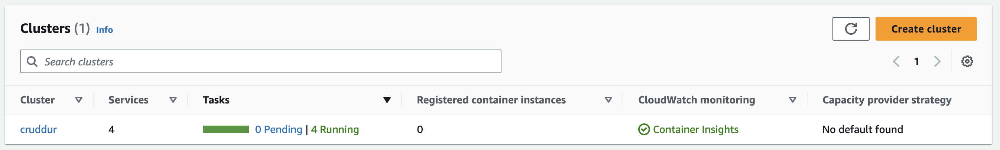

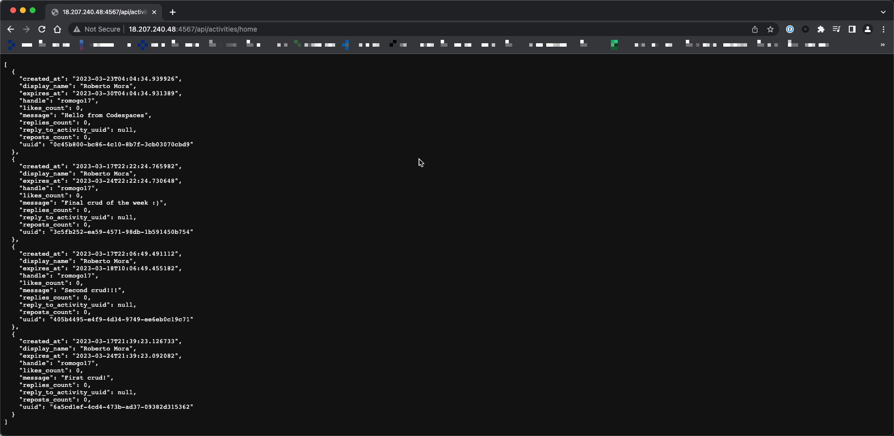

Notice how the task is being accessed over port `4567`. I want to call this out because, in reality, my frontend is not supposed to connect to this port. I'm using envoy as a proxy that redirects requests to an external authorization service. Envoy is running on port `8800`, but at this point, I hadn't deployed envoy

### Load balancer, listeners, target groups, envoy, frontend, custom domain, SSL

Once I had my backend running in ECR, I automated everything needed to access the backend through a load balancer, which in a nutshell involves creating the load balancer, a listener and a target groups, and associating my ECS service to update this target group

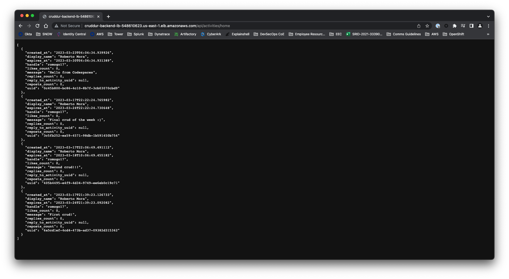

After this, and before setting up my frontend, I wanted to setup my envoy proxy and external authorization service. This took a LOT of time and troubleshooting. The specific challenges I had with envoy are documented below in [Issues with Envoy and Service Connect](#issues-with-envoy-and-service-connect)

After solving these issues, I was able to access my backend through port `8800`, which is the port Envoy listens on. Moreover, all requests would be forwarded to my Cognito autorhization service

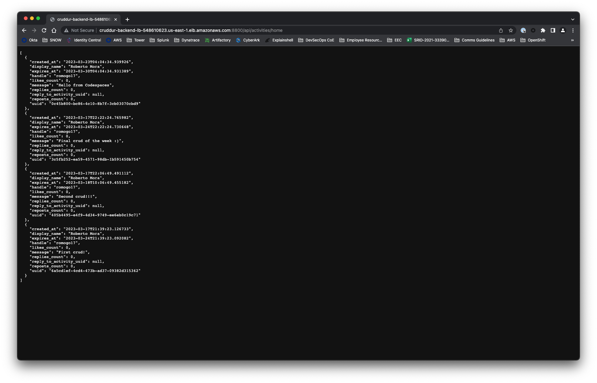

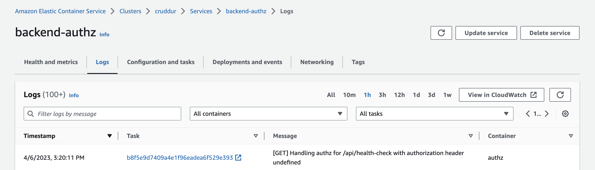

After this, I configured the frontend task, which was pretty straightforward. The only callout with this is that since we're hosting our app with Nginx, I found interesting that we need to build our bundle (`npm run build`) with the env vars already defined. But it makes sense, our app doesn't have haccess to `process.env` since it's not a Node.js process

Then, I created the SSL certs with ACM, and configured the required DNS records ([`infrastructure/02-app/dns.tf`](../infrastructure/02-app/dns.tf)). I also updated my load balancer to have the required forwarding rules to host frontend, backend (and in my case, the frontend OTEL collector) with the same load balancer.

After this, we had working frontends and backends :smile:

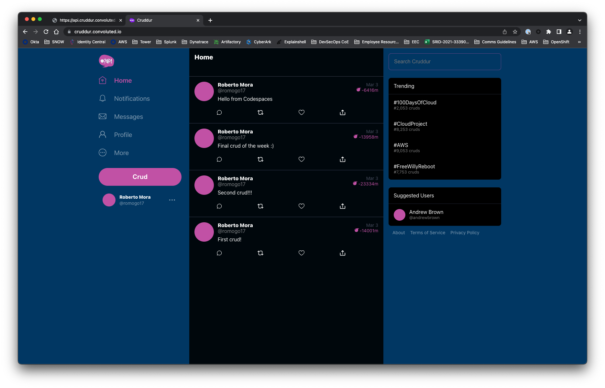

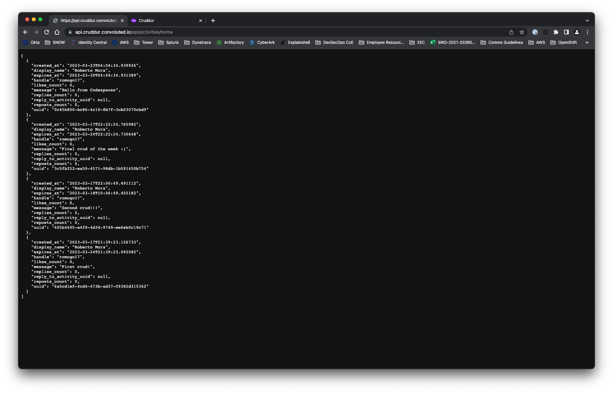

I didn't have to fix my messages page — that was already working

### Amazon Cognito refresh token

I did the implementation of the cognito refresh tokens.

Once I was done, I went back and fixes the issues with the promises so we don't have to await on a function that doesn't return anything and then go fetch the access token from `localStorage`. This improvement is outlined in [Use of `async/await` in `getAccessToken()`](#use-of-asyncawait-in-getaccesstoken)

### Refactor `bin/` directory

I reorganized my scripts a bit different than in the videos, as a lot of scripts seem to do slightly different things and there was a lot of duplicate boilerplate.

In particular, for each service, I had a single build-push script (since I always ended up doing both sequentially)

And for connecting to ECS tasks or forcing a deployment I had single scripts that take parameters for the corresponding task, service and/or container.

I didn't need deployment scripts because I'm deploying everything through Terraform

```
bin
├── ecr
│   └── login
├── ecs
│   ├── connect
│   └── redeploy
├── svc-authz
│   └── build-push
├── svc-backend
│   └── build-push
├── svc-envoy
│   └── build-push
├── svc-frontend
│   └── build-push
└── svc-otel-collector
    └── build-push
```

### XRay and container insights
After that, I added the Xray container to the tasks and enabled container insights in my cluster. I didn't face any of the issues covered during the majority of that video

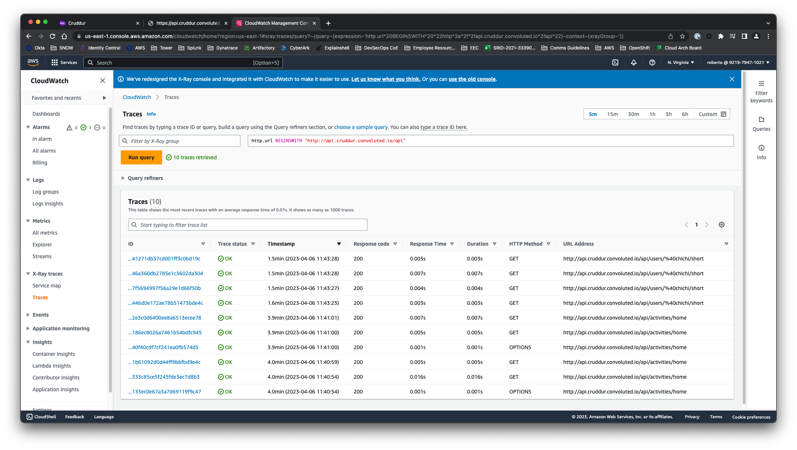

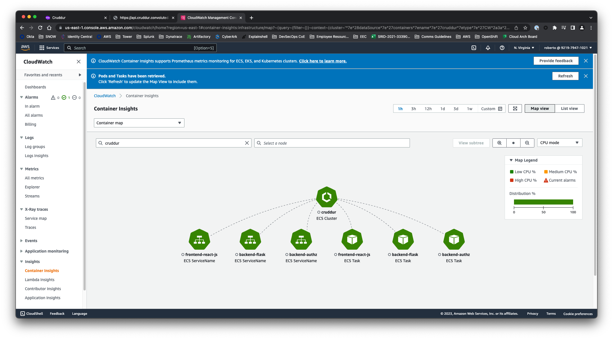

## Homework Challenges

### Issues with Envoy and Service Connect

I spent a lot of time troubleshooting an issue with Envoy, which is summarized in the image below. In a nutshell, the issue I had is that any time a request arrived for the backend, Envoy would try to first send it to my authorization service (`authz`), in order to figure out if the request was allowed or not. This is the expected behavior, but the issue is that Envoy tried to use an IPv6 address (AAAA record) that I didn't where it was coming from!

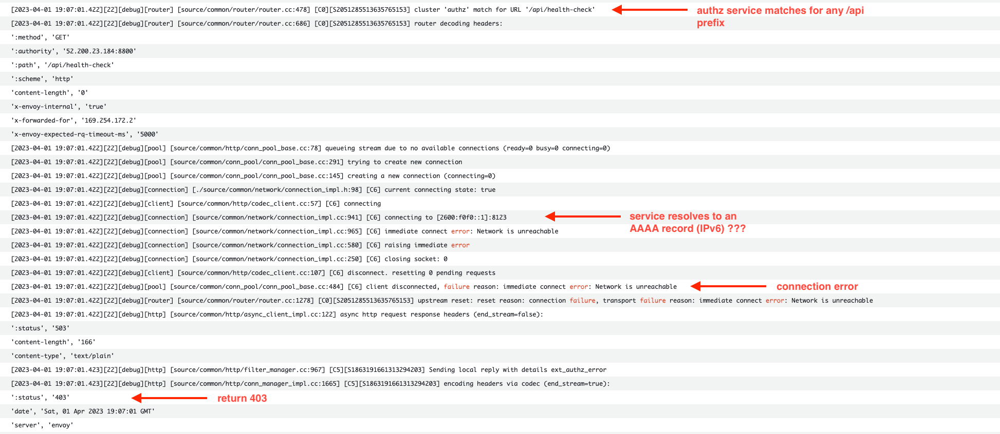

After doing some troubleshooting in the Envoy container, I found the following entries in `/etc/hosts`, which included both A and AAAA records for my service connect services.

```
root@ip-172-31-22-23:/# cat /etc/hosts
127.0.0.1 localhost
172.31.22.23 ip-172-31-22-23.ec2.internal
127.255.0.1 authz.cruddur
2600:f0f0:0:0:0:0:0:1 authz.cruddur
127.255.0.2 backend-flask.cruddur
2600:f0f0:0:0:0:0:0:2 backend-flask.cruddur
127.255.0.3 envoy.cruddur
2600:f0f0:0:0:0:0:0:3 envoy.cruddur
```
That at least explained where it was coming from, but why did it resolve to an `AAAA` record if both are available?

Enter, the [`dns_lookup_family`](https://www.envoyproxy.io/docs/envoy/latest/api-v3/config/cluster/v3/cluster.proto#envoy-v3-api-enum-config-cluster-v3-cluster-dnslookupfamily) setting. By default, this setting is setup to `AUTO`, which:

> If AUTO is specified, the DNS resolver will first perform a lookup for addresses in the IPv6 family and fallback to a lookup for addresses in the IPv4 family.

So that explained the issue. Envoy would resolve the `authz` service and prefered using the AAAA record. Since we don't have IPv6 enabled, the connection would fail.

```yml
  clusters:

...

    - name: authz
      connect_timeout: 5s
      type: STRICT_DNS
      lb_policy: ROUND_ROBIN
      dns_lookup_family: V4_ONLY

```

So I tweaked that value to `V4_ONLY` and that fixed the issue

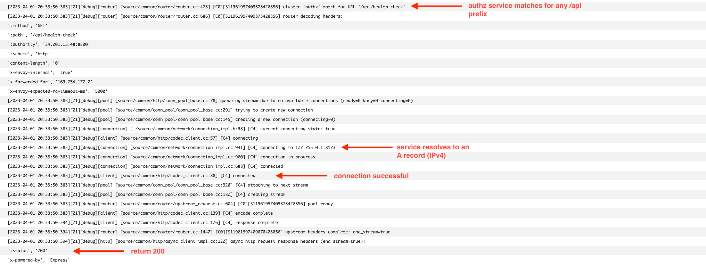

### Improving the security of the backend (IAM)

In the instructional content, [the backend was configured with AWS Access Keys](https://github.com/omenking/aws-bootcamp-cruddur-2023/blob/week-6-again/aws/task-definitions/backend-flask.json#L65-L66) `AWS_ACCESS_KEY_ID` and `AWS_SECRET_ACCESS_KEY`

```
"secrets": [
  {"name": "AWS_ACCESS_KEY_ID"    , "valueFrom": "arn:aws:ssm:ca-central-1:387543059434:parameter/cruddur/backend-flask/AWS_ACCESS_KEY_ID"},
  {"name": "AWS_SECRET_ACCESS_KEY", "valueFrom": "arn:aws:ssm:ca-central-1:387543059434:parameter/cruddur/backend-flask/AWS_SECRET_ACCESS_KEY"},
  ...
]
```

This is not a good security practice and doesn't follow the least privilege principle. If the backend were to be compromised with an remote code execution (RCE) vulnerability, or even with running arbitrary python code (as could happen if the debbuger is enabled), a threat actor could obtain control over the AWS account.

This could be mitigated by having these users be associated with an IAM user with limited scope, but unfortunately, for most bootcampers, they might be using access keys with administrator access.

The way this should be handled is through the use of IAM roles. Our ECS tasks are already running with an IAM role that has permissions to CloudWatch, XRay as well as some SSM permissions. All we need to do is add an additional policy that allows CRUD access to our DynamoDB table, such as this:

```json
{
    "Statement": [
        {
            "Action": [
                "dynamodb:GetItem",
                "dynamodb:DeleteItem",
                "dynamodb:PutItem",
                "dynamodb:Scan",
                "dynamodb:Query",
                "dynamodb:UpdateItem",
                "dynamodb:BatchWriteItem",
                "dynamodb:BatchGetItem",
                "dynamodb:DescribeTable",
                "dynamodb:ConditionCheckItem"
            ],
            "Effect": "Allow",
            "Resource": [
                "arn:aws:dynamodb:us-east-1:<ACCOUNT_ID>:table/cruddur-messages",
                "arn:aws:dynamodb:us-east-1:<ACCOUNT_ID>:table/cruddur-messages/index/*"
            ]
        }
    ],
    "Version": "2012-10-17"
}
```

In my case, since I'm doing everything with Terraform, the code is located in [`infrastructure/02-app/iam.tf`](../infrastructure/02-app/iam.tf)

### Use of `async/await` in `getAccessToken()`

I improved the `getAccessToken()` to use `async/await` instead of regular promises.

```js
export async function getAccessToken() {
    try {
        const cognito_user_session = await Auth.currentSession()
        const access_token = cognito_user_session.accessToken.jwtToken
        localStorage.setItem("access_token", access_token)

        return access_token
    } catch (err) {
        console.log(err)
    }
}
```

Even though async/await is just syntax sugar, this makes it easier to use and allows me to consume the function like this, which removes the need to use get the access token from the local storage

```js
const access_token = await getAccessToken()
```

### Enabled Honeycomb tracing for the frontend

In a previous challenged, I had enabled Honeycomb tracing for the frontend. During the deployment of the frontend, I had to disabe this.

Once I was done with everything else, I went back and deployed an OTEL collector, which is hosted at `otel-collector.${custom-domain}`

This is also now working for my app

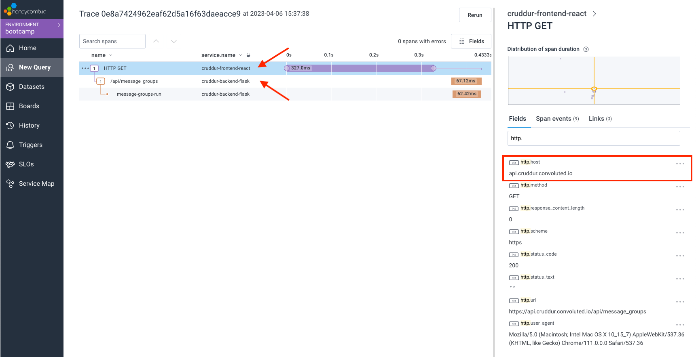